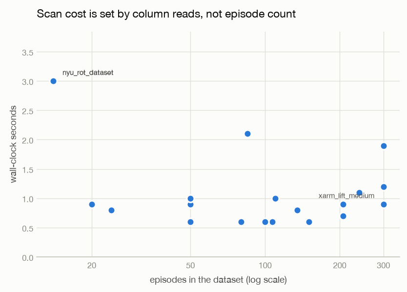
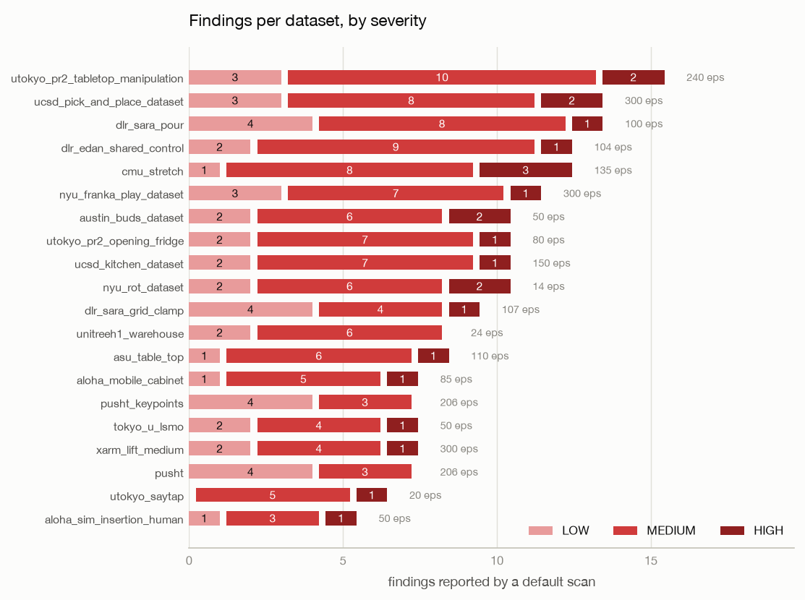
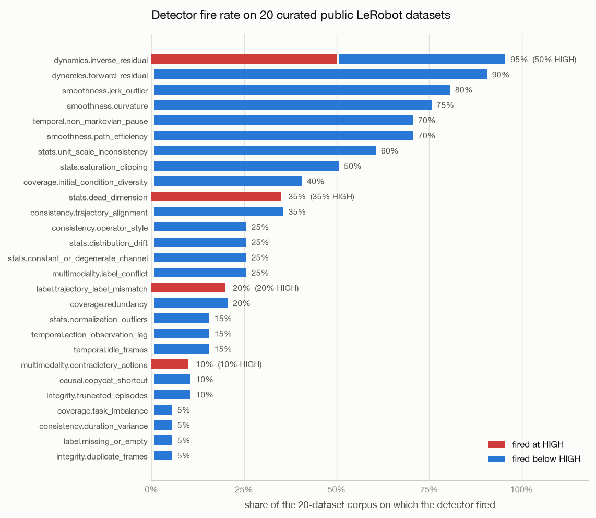

# Bohrin on 20 public LeRobot datasets

**A precision audit of 48 data-quality detectors against curated, published robot
demonstration data.**

| | |
| --- | --- |
| **Run date** | 2026-08-26 |
| **Bohrin version** | 0.1.0 |
| **Repository commit** | `cf39d78315ce113c6bfb79d711ac6ab50b0ab153` |
| **Corpus** | 20 LeRobot datasets from the Hugging Face Hub |
| **Raw results** | [`results/sweep.json`](results/sweep.json) |
| **Reproduce** | `python scripts/hub_smoke.py --json sweep.json` (from the repo root) |

---

## 1. Why this run exists

Bohrin's unit suite plants a known defect in a synthetic fixture and checks that the
matching detector finds it. That measures **recall**, and it cannot — even in principle —
measure **precision on healthy data**, because there is no healthy real data in the
fixtures. A detector that returns HIGH unconditionally would pass every recall test in the
suite.

Precision is the entire product. A HIGH severity that fires on most curated public
datasets carries no information, and it breaks `--fail-on HIGH` for anyone running bohrin
in CI — the exact opposite of what the tool is for. The only way to measure it is to point
the detectors at data that was collected, curated, published, and used by other people,
and to count how often they complain.

This report is that measurement. It is deliberately **not** a claim that bohrin's findings
are correct — see [§6, Limitations](#6-limitations-what-this-run-does-not-establish),
which is the most important section here.

## 2. Corpus

Twenty datasets, selected for breadth of embodiment and provenance rather than size:
ALOHA (simulated and mobile), xArm, PR2, Franka, Stretch, Unitree H1, the DLR/NYU/UCSD/
Tokyo lab rigs, and the `pusht` family. Action dimensionality spans 2 to 40; control rates
span 5 Hz to 50 Hz; both simulated and real-robot data are represented.

No video is fetched — bohrin reads Parquet columns and never decodes frames by default —
so the entire corpus is roughly 50 MB on disk.

| Dataset | `robot_type` | Hz | act dim | state dim | Episodes | Frames | Scan (s) | H | M | L |
| --- | --- | ---: | ---: | ---: | ---: | ---: | ---: | ---: | ---: | ---: |
| `xarm_lift_medium` | *unknown* | 15 | 4 | 4 | 300 | 20,000 | 0.9 | 1 | 4 | 2 |
| `ucsd_pick_and_place_dataset` | *unknown* | 5 | 4 | 7 | 300 | 67,750 | 1.2 | 2 | 8 | 3 |
| `nyu_franka_play_dataset` | *unknown* | 5 | 15 | 13 | 300 | 44,875 | 1.9 | 1 | 7 | 3 |
| `utokyo_pr2_tabletop_manipulation` | *unknown* | 5 | 8 | 7 | 240 | 32,708 | 1.1 | 2 | 10 | 3 |
| `pusht` | *unknown* | 10 | 2 | 2 | 206 | 25,650 | 0.7 | 0 | 3 | 4 |
| `pusht_keypoints` | *unknown* | 10 | 2 | 2 | 206 | 25,650 | 0.9 | 0 | 3 | 4 |
| `ucsd_kitchen_dataset` | *unknown* | 5 | 8 | 21 | 150 | 3,970 | 0.6 | 1 | 7 | 2 |
| `cmu_stretch` | *unknown* | 5 | 8 | 4 | 135 | 25,016 | 0.8 | 3 | 8 | 1 |
| `asu_table_top` | *unknown* | 5 | 7 | 7 | 110 | 26,113 | 1.0 | 1 | 6 | 1 |
| `dlr_sara_grid_clamp` | *unknown* | 5 | 7 | 12 | 107 | 7,622 | 0.6 | 1 | 4 | 4 |
| `dlr_edan_shared_control` | *unknown* | 5 | 7 | 7 | 104 | 8,928 | 0.6 | 1 | 9 | 2 |
| `dlr_sara_pour` | *unknown* | 5 | 7 | 6 | 100 | 12,971 | 0.6 | 1 | 8 | 4 |
| `aloha_mobile_cabinet` | `aloha` | 50 | 14 | 14 | 85 | 127,500 | 2.1 | 1 | 5 | 1 |
| `utokyo_pr2_opening_fridge` | *unknown* | 5 | 8 | 7 | 80 | 11,522 | 0.6 | 1 | 7 | 2 |
| `tokyo_u_lsmo` | *unknown* | 5 | 7 | 13 | 50 | 11,925 | 0.6 | 1 | 4 | 2 |
| `aloha_sim_insertion_human` | `aloha` | 50 | 14 | 14 | 50 | 25,000 | 0.9 | 1 | 3 | 1 |
| `austin_buds_dataset` | *unknown* | 5 | 7 | 24 | 50 | 34,112 | 1.0 | 2 | 6 | 2 |
| `unitreeh1_warehouse` | *unknown* | 50 | 40 | 19 | 24 | 11,275 | 0.8 | 0 | 6 | 2 |
| `utokyo_saytap` | *unknown* | 5 | 12 | 30 | 20 | 22,937 | 0.9 | 1 | 5 | 0 |
| `nyu_rot_dataset` | *unknown* | 5 | 7 | 7 | 14 | 440 | 3.0 | 2 | 6 | 2 |
| **Total** | | | | | **2,631** | **545,964** | **20.8** | **23** | **119** | **45** |

## 3. Result: 20/20 parsed, 20.8 s, 187 findings

Every dataset parsed, profiled, and reported with no crash, no unhandled exception, and no
adapter failure. All twenty resolved as `lerobot_v3`.

- **Coverage.** 20/20 scanned successfully — 2,631 episodes, 545,964 frames.
- **Cost.** 20.8 s wall-clock for the whole corpus on an Apple M4 / 16 GB laptop, warm
  cache, CPU only. Median 0.9 s per dataset; range 0.6 s – 3.0 s.
- **Yield.** 187 findings: **23 HIGH, 119 MEDIUM, 45 LOW.** 17 of 20 datasets produced at
  least one HIGH. No dataset came back completely clean.



Scan cost is essentially flat in episode count (Figure 3). `nyu_rot_dataset` is the slowest
at 3.0 s despite being the *smallest* dataset in the corpus (14 episodes, 440 frames) —
it was scanned first, so it absorbed one-time interpreter and scikit-learn import cost.
`aloha_mobile_cabinet`, with 290× more frames, took 2.1 s. Wall time here tracks column
reads and per-detector fixed cost, not data volume.



## 4. The precision measurement

This is what the sweep is for. Of the **46 detectors that run in a default scan**
(48 registered, 2 held back — see §5), **27 fired at least once** and **19 never fired on
any dataset**. Only **four** ever reached HIGH.



### 4.1 Detectors that reach HIGH

| Detector | Fires on | Of which HIGH | Reading |
| --- | ---: | ---: | --- |
| `dynamics.inverse_residual` | 95% | **50%** | ⚠️ Under suspicion — see §4.2 |
| `stats.dead_dimension` | 35% | 35% | Plausible; dead dimensions are genuinely common |
| `label.trajectory_label_mismatch` | 20% | 20% | Plausible at this rate |
| `multimodality.contradictory_actions` | 10% | 10% | Plausible at this rate |

### 4.2 `dynamics.inverse_residual` is the outstanding problem

It fires on 19 of 20 datasets and returns HIGH on 10 of 20. **A detector that reports HIGH
on half of curated, published, widely used datasets is far more likely to have a threshold
bug than to have found an epidemic.**

Two readings are consistent with this number, and the sweep cannot distinguish them:

1. **The threshold is loose.** The residual of a fitted inverse-dynamics model is being
   compared against a bound that ordinary sensor noise and 5 Hz sub-sampling routinely
   exceed. Most of the corpus is 5 Hz, which is slow enough that consecutive states are
   only weakly related by the logged action.
2. **The finding is real.** Action/observation misalignment is a genuinely common defect in
   converted datasets, and most of this corpus was converted from RLDS/Open-X rather than
   recorded natively in LeRobot format.

Adjudicating between these is exactly the work §6 says has not been done. Until it is, the
honest statement is: *this detector's HIGH rate is not yet trustworthy.*

### 4.3 The 19 detectors that never fired

Nineteen of the 46 default detectors produced no finding on any of the 2,631 episodes.
That is **not** evidence they are broken — several target defects this corpus should not
have (`integrity.nan_inf`, the vision family with video decoding off, the entire
POLICY↔DATA family, which stays silent without `--policy` or `--target`). But it does mean
those detectors have **zero real-data evidence** behind their thresholds in this run, and
their default severities rest on synthetic fixtures alone. Any future report should say so
rather than implying 46 detectors were validated.

## 5. Two detectors were correctly held back

`DEFAULT_EXCLUDED` in `src/bohrin/detectors/registry.py` holds two implemented, tested,
benchmarked detectors out of a default scan pending recalibration:

- `smoothness.discontinuity_jump`
- `integrity.declared_mismatch`

Both are absent from every finding in this sweep, confirming the exclusion mechanism works
as intended. They were excluded on the basis of an earlier run of this same harness, in
which they reported HIGH on 70% and 60% of the corpus respectively. They remain reachable
with `--all`.

This is the project's stated alternative to deleting a noisy detector: measure it, document
the number, and gate it — never remove tested code to make a report look cleaner.

## 6. Limitations — what this run does **not** establish

Read this section before quoting any number above.

**6.1 Fire rate is not precision.** This is the central caveat. Nothing here establishes
that a single finding is *correct*. A 95% fire rate is consistent with "95% of public
robot datasets have this defect" and equally consistent with "the threshold is too tight."
No ground-truth labels exist for this corpus, and none were constructed. **Every rate in
this report is a rate of complaint, not a rate of correctness.** The obvious next step is
to hand-adjudicate a stratified sample of findings against the underlying Parquet and
publish a precision estimate with an explicit N.

**6.2 Selection bias, in both directions.** These twenty datasets were chosen by the
project's own maintainer. They are curated and widely used, which biases *toward* clean
data and makes a high fire rate more suspicious — that is the intended direction. But they
are also overwhelmingly conversions of Open-X/RLDS data at 5 Hz, which is a narrow slice of
how robot data actually gets recorded, and defects introduced by that conversion pipeline
will be over-represented.

**6.3 Single machine, single run.** One laptop (Apple M4, 16 GB, macOS 15.5, Python
3.10.21), one pass, warm HTTP cache. Timings are indicative, not benchmarked: no repeats,
no confidence intervals, no cold/warm separation beyond the note in §3.

**6.4 The default configuration only.** No `--policy`, no `--target`, no `--all`, no
`--full`, no calibration corpus, vision off. The five POLICY↔DATA detectors were inert by
construction, and the conformal gate fell back to its robust-z heuristic throughout
(see 6.5). A different configuration produces different numbers.

**6.5 The calibration corpus was empty, and public metadata may make it hard to fill.**
Bohrin's `--fpr` flag becomes a genuine per-embodiment false-discovery bound only when a
calibration corpus built by `bohrin calibrate` covers the dataset's embodiment — Mondrian
conformal prediction, keyed on embodiment as the taxonomy. No corpus ships with the
package, so every scan in this sweep used the fallback heuristic and `--fpr` was
effectively inert.

Filling that gap runs into a metadata problem this sweep surfaced by accident: **18 of the
20 datasets declare `robot_type: "unknown"`.** Only the two ALOHA datasets name their
embodiment. A Mondrian taxonomy keyed on a field that 90% of public data leaves blank
collapses to the single `"*"` wildcard bucket, which forfeits exactly the
group-conditional validity the design was chosen for. This is a finding about the
ecosystem's metadata hygiene as much as about bohrin, and it is a prerequisite for any
shipped calibration corpus — not a detail.

**6.6 Warnings observed but not investigated.** Several scans emitted
`RuntimeWarning: divide by zero / overflow / invalid value encountered in matmul` from
`sklearn.utils.extmath` during the dynamics fits. No scan failed, and results are reported
as produced, but these indicate degenerate matrices reaching the ridge solve and should be
traced before the next release.

## 7. Reproducing this run

```bash
git clone https://github.com/prabhu-gopal/bohrin && cd bohrin
git checkout cf39d78
python -m venv .venv && .venv/bin/pip install -e '.[dev]'
.venv/bin/python scripts/hub_smoke.py --json sweep.json
```

Roughly 50 MB is downloaded from the Hugging Face Hub on a cold cache. Regenerate the
figures from the committed results:

```bash
python -m venv .venv-figures
.venv-figures/bin/pip install -r scripts/requirements.txt
.venv-figures/bin/python scripts/make_figures.py
```

Dataset revisions are not pinned; a Hub-side update will change the numbers. Every figure
derives from `results/sweep.json` alone, so the committed JSON is the authority if a figure
and this text ever disagree.

## 8. What changes next

1. **Adjudicate `dynamics.inverse_residual`.** Hand-label a stratified sample of its HIGHs
   against the underlying Parquet. Either fix the threshold with the evidence, or add it to
   `DEFAULT_EXCLUDED` with the numbers recorded — the same path the two currently excluded
   detectors took.
2. **Publish a precision estimate with an N.** A measured number on 20 adjudicated findings
   is worth more than an unfalsifiable claim about 48 detectors.
3. **Resolve the embodiment-metadata gap** before shipping a default calibration corpus.
   Inferring embodiment from action/state dimensionality and control rate is one option;
   another is to accept the `"*"` bucket and stop claiming group-conditional validity.
4. **Trace the `matmul` warnings** in the dynamics fits.

---

*Environment: Python 3.10.21, numpy 2.2.6, polars 1.44.0, scikit-learn 1.7.2,
huggingface-hub 1.28.0, pydantic 2.13.4, rich 15.0.0. macOS 15.5 (Darwin 25.5.0),
Apple M4, 16 GB. Figures generated with matplotlib 3.11.1 in a separate environment —
matplotlib is a reporting tool and is deliberately not a bohrin dependency.*
