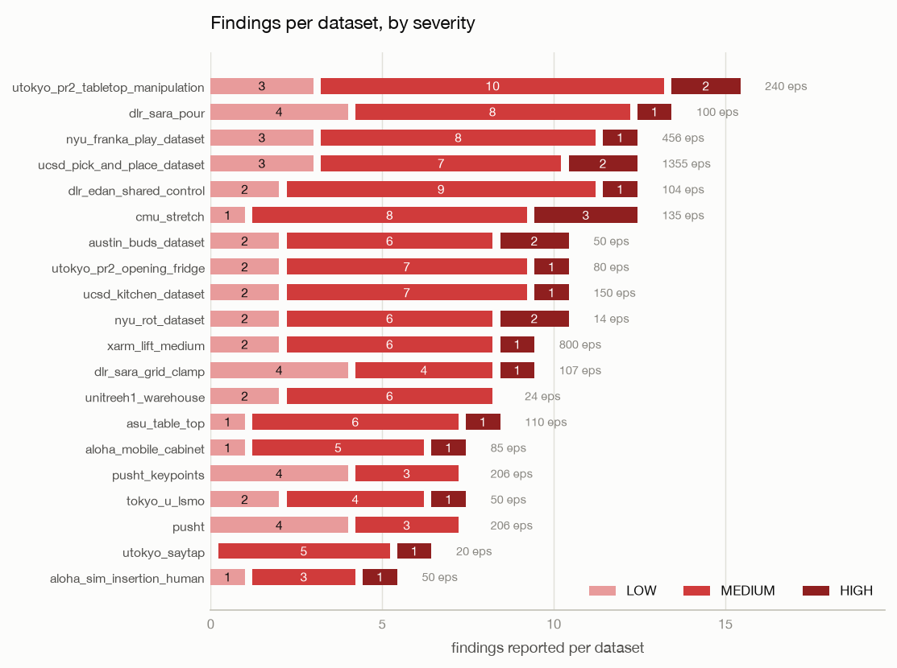
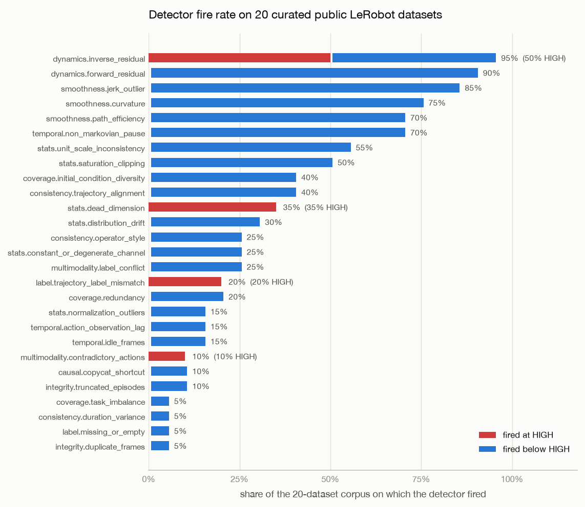

# A Precision Audit of Robot Data-Quality Detectors

**46 static checks measured against 20 public LeRobot datasets: 4,342 episodes,
545,964 frames, 22 seconds.**

| | |
| --- | --- |
| Run date | 2026-08-26 |
| Bohrin version | 0.1.0 |
| Repository commit | `cf39d78` |
| Corpus | 20 LeRobot datasets from the Hugging Face Hub |
| Raw results | [`results/sweep_full.json`](results/sweep_full.json), [`results/sweep_default.json`](results/sweep_default.json) |
| Reproduce | `python scripts/run_sweep.py --out results/` |

---

## Summary

Bohrin reads logged robot demonstration data and reports defects known to degrade a
behavior-cloned policy. This run measures how often it complains about data that other
people collected, curated, published, and trained on.

- **Coverage.** 20 of 20 datasets parsed, profiled, and reported with no crash and no
  adapter failure. All resolved as `lerobot_v3`.
- **Cost.** 22.3 s for the full corpus on a laptop CPU with no GPU and no video decoded.
  Median 0.8 s per dataset.
- **Yield.** 189 findings: 23 HIGH, 121 MEDIUM, 45 LOW. Every dataset produced at least
  one finding; 17 of 20 produced at least one HIGH.
- **Selectivity.** Of 46 detectors that run by default, 27 fired at least once, 19 never
  fired, and 4 ever reached HIGH.
- **One detector fails its own audit.** `dynamics.inverse_residual` reports HIGH on 50% of
  the corpus. Section 5 argues this is more likely a threshold defect than a real epidemic,
  and identifies a specific mechanism worth checking.

What this run does not do is establish that any finding is correct. Section 7 is the part
to read before quoting any number here.

## 1. Why this run exists

Bohrin's unit suite plants a known defect in a synthetic fixture and checks that the
matching detector finds it. That measures recall. It cannot measure precision on healthy
data, because the fixtures contain no healthy real data: a detector hard-coded to return
HIGH would pass every test in the suite.

Precision determines whether the tool is usable. A HIGH severity that fires on most curated
public datasets carries no information, and it breaks a `--fail-on HIGH` CI gate for every
user. Measuring it requires real data and a count of complaints.

## 2. Corpus

Twenty LeRobot datasets, chosen for breadth of embodiment and provenance rather than size.
Fourteen are Open X-Embodiment datasets that reached LeRobot through an RLDS conversion
[[1](#references)]; six were published natively for LeRobot. Four are simulated. Action
dimensionality spans 2 to 40 and control rates span 5 Hz to 50 Hz.

Bohrin does not decode video, so the corpus occupies roughly 50 MB on disk.

| Dataset | Source | Provenance | Hz | act | state | Episodes | Frames | Scan (s) | H | M | L |
| --- | --- | --- | ---: | ---: | ---: | ---: | ---: | ---: | ---: | ---: | ---: |
| `ucsd_pick_and_place_dataset` | real | OXE | 5 | 4 | 7 | 1,355 | 67,750 | 4.2 | 2 | 7 | 3 |
| `xarm_lift_medium` | sim | native | 15 | 4 | 4 | 800 | 20,000 | 1.6 | 1 | 6 | 2 |
| `nyu_franka_play_dataset` | real | OXE | 5 | 15 | 13 | 456 | 44,875 | 2.4 | 1 | 8 | 3 |
| `utokyo_pr2_tabletop_manipulation` | real | OXE | 5 | 8 | 7 | 240 | 32,708 | 1.1 | 2 | 10 | 3 |
| `pusht` | sim | native | 10 | 2 | 2 | 206 | 25,650 | 0.7 | 0 | 3 | 4 |
| `pusht_keypoints` | sim | native | 10 | 2 | 2 | 206 | 25,650 | 0.9 | 0 | 3 | 4 |
| `ucsd_kitchen_dataset` | real | OXE | 5 | 8 | 21 | 150 | 3,970 | 0.6 | 1 | 7 | 2 |
| `cmu_stretch` | real | OXE | 5 | 8 | 4 | 135 | 25,016 | 0.8 | 3 | 8 | 1 |
| `asu_table_top` | real | OXE | 5 | 7 | 7 | 110 | 26,113 | 0.8 | 1 | 6 | 1 |
| `dlr_sara_grid_clamp` | real | OXE | 5 | 7 | 12 | 107 | 7,622 | 0.6 | 1 | 4 | 4 |
| `dlr_edan_shared_control` | real | OXE | 5 | 7 | 7 | 104 | 8,928 | 0.6 | 1 | 9 | 2 |
| `dlr_sara_pour` | real | OXE | 5 | 7 | 6 | 100 | 12,971 | 0.7 | 1 | 8 | 4 |
| `aloha_mobile_cabinet` | real | native | 50 | 14 | 14 | 85 | 127,500 | 2.1 | 1 | 5 | 1 |
| `utokyo_pr2_opening_fridge` | real | OXE | 5 | 8 | 7 | 80 | 11,522 | 0.6 | 1 | 7 | 2 |
| `tokyo_u_lsmo` | real | OXE | 5 | 7 | 13 | 50 | 11,925 | 0.7 | 1 | 4 | 2 |
| `aloha_sim_insertion_human` | sim | native | 50 | 14 | 14 | 50 | 25,000 | 0.8 | 1 | 3 | 1 |
| `austin_buds_dataset` | real | OXE | 5 | 7 | 24 | 50 | 34,112 | 1.1 | 2 | 6 | 2 |
| `unitreeh1_warehouse` | real | native | 50 | 40 | 19 | 24 | 11,275 | 0.6 | 0 | 6 | 2 |
| `utokyo_saytap` | real | OXE | 5 | 12 | 30 | 20 | 22,937 | 0.8 | 1 | 5 | 0 |
| `nyu_rot_dataset` | real | OXE | 5 | 7 | 7 | 14 | 440 | 0.4 | 2 | 6 | 2 |
| **Total** | | | | | | **4,342** | **545,964** | **22.3** | **23** | **121** | **45** |

Embodiments were confirmed from published sources where possible: `asu_table_top` is a UR5
commanding joint velocities [[2](#references)], `austin_buds_dataset` and
`nyu_franka_play_dataset` are Franka arms [[2](#references)], `cmu_stretch` is a Hello Robot
Stretch [[3](#references)], `dlr_edan_shared_control` is a wheelchair-mounted 8-DoF DLR
arm [[4](#references)], and `utokyo_saytap` is a Unitree Go1 quadruped [[5](#references)],
which makes it the one locomotion dataset in an otherwise manipulation-heavy corpus. The
remaining platforms were not verified against a primary source and are not claimed here.

### 2.1 Method

Each dataset was scanned twice. The **full** pass (`full=True`) reads every episode and is
the basis for every number in this report. The **default** pass is what a user gets from
`bohrin scan`: a triage scan capped at 300 episodes
(`DEFAULT_TRIAGE_EPISODES`), which subsamples 3 of the 20 datasets. Section 6 compares them.

Both passes used no policy checkpoint, no `--target`, no `--all`, no calibration corpus,
and no vision. The harness is [`scripts/run_sweep.py`](scripts/run_sweep.py); raw output is
committed, and every figure and table derives from it programmatically.

## 3. Cost


Wall time correlates with episode count at *r* = 0.87 and with frame count at *r* = 0.68,
so per-episode fixed work dominates rather than raw data volume. `aloha_mobile_cabinet`
reads 127,500 frames in 2.1 s; `ucsd_pick_and_place_dataset` reads about half that in 4.2 s
because it has 16× more episodes. Growth is sub-linear: 97× more episodes costs 10.5× more
time. Throughput ranges from 1,100 to 60,000 frames/s with a median of 19,000.

## 4. Selectivity





Of the 46 detectors that run in a default scan (48 registered, 2 held back per Section 8),
27 fired at least once and 19 never fired. Four ever reached HIGH.

| Detector | Fires on | Of which HIGH | Reading |
| --- | ---: | ---: | --- |
| `dynamics.inverse_residual` | 95% | **50%** | Under suspicion (Section 5) |
| `stats.dead_dimension` | 35% | 35% | Plausible; dead dimensions are common |
| `label.trajectory_label_mismatch` | 20% | 20% | Plausible at this rate |
| `multimodality.contradictory_actions` | 10% | 10% | Plausible at this rate |

## 5. `dynamics.inverse_residual` fails its own audit

The detector fires on 19 of 20 datasets and returns HIGH on 10 of 20. A HIGH on half of a
curated, published, widely used corpus is more likely to be a threshold defect than a real
epidemic.

Three explanations are consistent with the number, and this run cannot fully separate them.

**The ridge solve is ill-conditioned.** During these scans scikit-learn emitted
`LinAlgWarning: Ill-conditioned matrix (rcond=7.05e-17): result may not be accurate` from
`sklearn.linear_model._ridge`, alongside `divide by zero`, `overflow`, and `invalid value`
warnings from `sklearn.utils.extmath` (Section 7.6). The detector fits an inverse-dynamics
model *g*(*oₜ*, *oₜ₊₁*) → *âₜ* and thresholds its residual. If the design matrix is
near-singular, the fit is unreliable and so is the residual. This is a concrete, checkable
hypothesis rather than a guess, and it is the first thing to test.

**The threshold does not account for control rate.** Fourteen of the twenty datasets run at
5 Hz. At 200 ms per step, consecutive states are only weakly related by the action between
them, so an inverse-dynamics residual is legitimately large without any misalignment. A
threshold calibrated on higher-rate data would over-fire here systematically.

**The finding is real.** Action/observation misalignment is a known hazard of format
conversion, and 14 of the 20 datasets reached LeRobot through an RLDS conversion of an
already-converted OXE dataset. Two conversion hops is a plausible place to lose
synchronization.

The first two explanations are defects in bohrin; the third is a defect in the data.
Separating them requires the adjudication described in Section 7.1. Until then the honest
statement is that this detector's HIGH severity is not yet trustworthy.

## 6. Triage sampling does not change the conclusions

The default scan caps at 300 episodes, which subsamples `ucsd_pick_and_place_dataset`
(300 of 1,355), `xarm_lift_medium` (300 of 800), and `nyu_franka_play_dataset` (300 of 456).
It reads 2,631 of 4,342 episodes (61%) and 465,692 of 545,964 frames (85%), in 21.5 s
against 22.3 s.

Comparing the two passes:

| Quantity | Default (triage) | Full |
| --- | ---: | ---: |
| Datasets scanned without error | 20 | 20 |
| HIGH findings | 23 | 23 |
| MEDIUM findings | 119 | 121 |
| LOW findings | 45 | 45 |
| Datasets with ≥1 HIGH | 17 | 17 |
| Detectors that fired | 27 | 27 |
| Detectors reaching HIGH | 4 | 4 |

Every HIGH is identical. Two MEDIUM findings out of 189 differ, and four detectors shift by
one dataset each (`consistency.trajectory_alignment` 7→8, `smoothness.jerk_outlier` 16→17,
`stats.distribution_drift` 5→6, `stats.unit_scale_inconsistency` 12→11), all on the three
subsampled datasets. Triage is a reasonable default on this corpus. That is a statement
about these 20 datasets, not a general guarantee.

## 7. Limitations

Read this section before quoting any number above.

**7.1 Fire rate is not precision.** Nothing here establishes that a single finding is
correct. A 95% fire rate is equally consistent with "95% of public robot datasets have this
defect" and with "the threshold is too tight." No ground-truth labels exist for this corpus
and none were constructed. Every rate reported here is a rate of complaint. The next step
is to hand-adjudicate a stratified sample against the underlying Parquet and publish a
precision estimate with an explicit *N*.

**7.2 No link to downstream policy performance.** This is the most important gap. Bohrin's
premise is that these defects degrade a trained policy. This report does not test that
premise. It does not train a single policy, ablate a single defect, or measure a single
success rate. The mechanisms behind each detector are drawn from the literature, not from
an experiment run here. A defensible causal claim requires training policies on data with
and without a given defect and measuring the difference in rollout success. Until that
exists, severity is a triage ordering, not a prediction of harm.

**7.3 Selection bias, in both directions.** The datasets were chosen by the project's own
maintainer. They are curated and widely used, which biases toward clean data and makes a
high fire rate more suspicious, the intended direction. They are also predominantly 5 Hz
OXE conversions, a narrow slice of how robot data gets recorded, so conversion artifacts
are over-represented and native high-rate teleoperation is under-represented.

**7.4 Single machine, single run.** One laptop CPU, no GPU, one pass per configuration,
warm HTTP cache. Timings are indicative rather than benchmarked: no repeats, no confidence
intervals, no cold-start separation.

**7.5 Default configuration only.** No checkpoint, target, calibration corpus, or vision.
The five POLICY↔DATA detectors were inert by construction, and the vision family had
nothing to read. A different configuration produces different numbers.

**7.6 The conformal gate never activated, and public metadata may prevent fixing that.**
Bohrin's `--fpr` becomes a false-discovery bound only when a calibration corpus covers the
dataset's embodiment, using embodiment as a Mondrian category [[6](#references)]. No corpus
ships with the package, so every scan fell back to a robust-*z* heuristic and `--fpr` was
inert.

Filling that gap meets an obstacle this run surfaced incidentally: **18 of the 20 datasets
declare `robot_type: "unknown"`**, with only the two ALOHA datasets naming an embodiment. A
Mondrian taxonomy keyed on a field that 90% of this corpus leaves blank collapses to a
single wildcard bucket and forfeits the group-conditional validity the design was chosen
for. This is a finding about ecosystem metadata as much as about the tool.

**7.7 Numerical warnings were observed and not resolved.** See Section 5. No scan failed
and results are reported as produced, but an ill-conditioned ridge solve reaching the
dynamics fit is a correctness concern, not cosmetic noise.

**7.8 Dataset revisions are not pinned.** A Hub-side update will change these numbers.

## 8. Two detectors were correctly held back

`DEFAULT_EXCLUDED` in `src/bohrin/detectors/registry.py` withholds two implemented, tested
detectors from a default scan pending recalibration, reachable with `--all`:
`smoothness.discontinuity_jump` and `integrity.declared_mismatch`. They were excluded after
an earlier run of this harness measured them reporting HIGH on 70% and 60% of the corpus.
Neither appears in any finding here, confirming the mechanism works.

This is the project's alternative to deleting a noisy detector: measure it, record the
number, and gate it.

## 9. Reproducing

```bash
git clone https://github.com/prabhu-gopal/bohrin && cd bohrin
git checkout cf39d78
python -m venv .venv && .venv/bin/pip install -e '.[dev]'
cd benchmarks/2026-08-26-lerobot-20-v0.1.0
../../.venv/bin/python scripts/run_sweep.py --out results/
```

About 50 MB is downloaded from the Hub on a cold cache. Regenerate the figures from the
committed results:

```bash
python -m venv .venv-figures
.venv-figures/bin/pip install -r scripts/requirements.txt
.venv-figures/bin/python scripts/make_figures.py
```

Every figure derives from `results/sweep_full.json` alone. If a figure and this text
disagree, the JSON is correct.

## 10. What changes next

1. **Test the ill-conditioning hypothesis** for `dynamics.inverse_residual`. Log the
   condition number of the design matrix per dataset and check whether it predicts the HIGH
   findings. If it does, the fix is regularization or an abstention, not a new threshold.
2. **Make the residual threshold control-rate aware**, or verify that it already is.
3. **Publish a precision estimate with an explicit *N*** from hand-adjudicated findings.
4. **Run a policy-outcome experiment** on at least one detector, to convert a mechanism
   argument into a measurement (Section 7.2).
5. **Resolve the embodiment-metadata gap** before shipping a default calibration corpus.

## References

1. Open X-Embodiment Collaboration. *Open X-Embodiment: Robotic Learning Datasets and RT-X
   Models.* arXiv:2310.08864. <https://robotics-transformer-x.github.io/>
2. TensorFlow Datasets catalog, Open X-Embodiment entries
   (`asu_table_top_converted_externally_to_rlds`, `austin_buds_dataset_converted_externally_to_rlds`,
   `nyu_franka_play_dataset_converted_externally_to_rlds`).
   <https://www.tensorflow.org/datasets/catalog/overview>
3. Bahl et al. *Affordances from Human Videos as a Versatile Representation for Robotics.*
   CVPR 2023. <https://github.com/shikharbahl/cmu_stretch_dataset>
4. Vogel et al. *EDAN: An EMG-controlled Daily Assistant to Help People with Physical
   Disabilities.* DLR. <https://www.dlr.de/en/rm/research/robotic-systems/mobile-platforms/edan>
5. Tang et al. *SayTap: Language to Quadrupedal Locomotion.* <https://saytap.github.io/>
6. Vovk et al. *Algorithmic Learning in a Random World* (Mondrian conformal prediction).
   Springer, 2005.

---

*Environment: Python 3.10.21, numpy 2.2.6, polars 1.44.0, scikit-learn 1.7.2,
huggingface-hub 1.28.0, pydantic 2.13.4, rich 15.0.0. Laptop CPU, no GPU. Figures generated
with matplotlib 3.11.1 in a separate environment; matplotlib is a reporting tool and is
deliberately not a bohrin dependency.*
