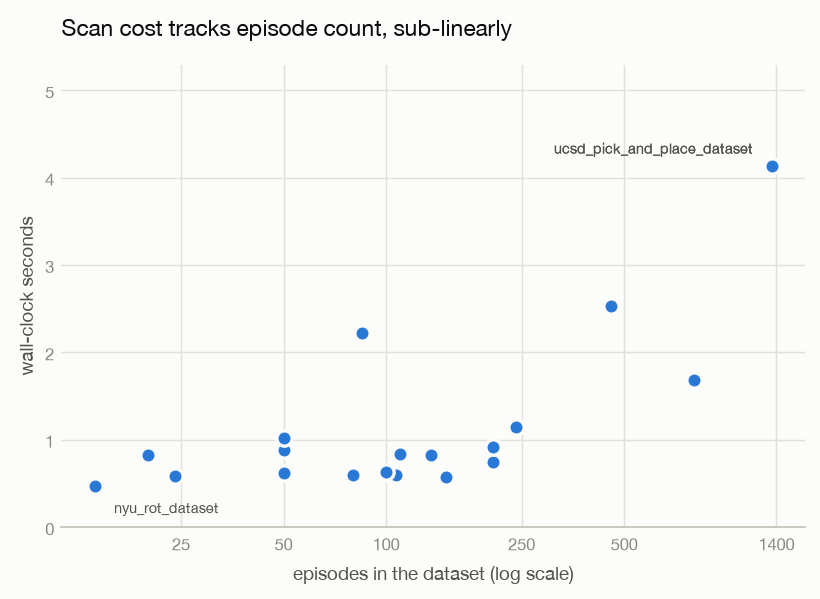

# A Precision Audit of Robot Data-Quality Detectors

**46 static checks measured against 20 public LeRobot datasets: 4,342 episodes,
545,964 frames, 22 seconds.**

| | |
| --- | --- |
| Run date | 2026-08-26 |
| Bohrin version | 0.1.0 |
| Repository commit | `cf39d78` |
| Corpus | 20 LeRobot datasets from the Hugging Face Hub |
| Raw results | [`results/sweep_full.json`](results/sweep_full.json), [`results/sweep_default.json`](results/sweep_default.json) |
| Reproduce | `python scripts/run_sweep.py --out results/` |

---

## Summary

Bohrin reads logged robot demonstration data and reports defects known to degrade a
behavior-cloned policy. This run measures how often it complains about data that other
people collected, curated, published, and trained on.

**The most consequential result is not about bohrin.** 18 of the 20 datasets declare
`robot_type: "unknown"`. Only the two ALOHA datasets name an embodiment. Any method that
conditions on embodiment using Hugging Face Hub metadata therefore degenerates to a single
undifferentiated bucket on 90% of this corpus. That includes bohrin's own conformal gate,
whose Mondrian taxonomy is keyed on exactly that field, so `--fpr` cannot deliver the
group-conditional guarantee it was designed for. Section 7.6 develops this.

On the tool itself:

- **Coverage.** 20 of 20 datasets parsed, profiled, and reported with no crash and no
  adapter failure. All resolved as `lerobot_v3`.
- **Cost.** 22.5 s for the full corpus on a laptop CPU, no GPU, no video decoded.
- **Yield.** 190 findings: 23 HIGH, 121 MEDIUM, 46 LOW. Every dataset produced findings;
  17 of 20 produced at least one HIGH.
- **Selectivity.** Of 46 detectors that run by default, 27 fired at least once, 19 never
  fired, and 4 ever reached HIGH.
- **Six detectors are effectively always-on** (Section 5), and they, not the HIGH findings,
  are what makes a report long.
- **The report is too long to act on** (Section 4). A median of 9.5 findings per dataset,
  with no dataset ever coming back clean, is a usability defect this run measured in its
  own output.

What this run does not do is establish that any finding is correct. Section 8 is the part
to read before quoting any number here.

## 1. Why this run exists

Bohrin's unit suite plants a known defect in a synthetic fixture and checks that the
matching detector finds it. That measures recall. It cannot measure precision on healthy
data, because the fixtures contain no healthy real data: a detector hard-coded to return
HIGH would pass every test in the suite.

Precision determines whether the tool is usable. A HIGH severity that fires on most curated
public datasets carries no information, and it breaks a `--fail-on HIGH` CI gate for every
user. Measuring it requires real data and a count of complaints.

## 2. Corpus

Twenty LeRobot datasets, chosen for breadth of embodiment and provenance rather than size.
Fourteen are Open X-Embodiment datasets that reached LeRobot through an RLDS conversion
[[1](#references)]; six were published natively for LeRobot. Four are simulated. Action
dimensionality spans 2 to 40 and control rates span 5 Hz to 50 Hz.

Bohrin does not decode video, so the corpus occupies roughly 50 MB on disk.

| Dataset | Source | Provenance | Hz | act | state | Episodes | Frames | Scan (s) | H | M | L |
| --- | --- | --- | ---: | ---: | ---: | ---: | ---: | ---: | ---: | ---: | ---: |
| `ucsd_pick_and_place_dataset` | real | OXE | 5 | 4 | 7 | 1,355 | 67,750 | 4.1 | 2 | 7 | 3 |
| `xarm_lift_medium` | sim | native | 15 | 4 | 4 | 800 | 20,000 | 1.7 | 1 | 6 | 2 |
| `nyu_franka_play_dataset` | real | OXE | 5 | 15 | 13 | 456 | 44,875 | 2.5 | 1 | 8 | 3 |
| `utokyo_pr2_tabletop_manipulation` | real | OXE | 5 | 8 | 7 | 240 | 32,708 | 1.1 | 2 | 10 | 3 |
| `pusht` | sim | native | 10 | 2 | 2 | 206 | 25,650 | 0.8 | 0 | 3 | 4 |
| `pusht_keypoints` | sim | native | 10 | 2 | 2 | 206 | 25,650 | 0.9 | 0 | 3 | 4 |
| `ucsd_kitchen_dataset` | real | OXE | 5 | 8 | 21 | 150 | 3,970 | 0.6 | 1 | 7 | 2 |
| `cmu_stretch` | real | OXE | 5 | 8 | 4 | 135 | 25,016 | 0.8 | 3 | 8 | 1 |
| `asu_table_top` | real | OXE | 5 | 7 | 7 | 110 | 26,113 | 0.8 | 1 | 6 | 1 |
| `dlr_sara_grid_clamp` | real | OXE | 5 | 7 | 12 | 107 | 7,622 | 0.6 | 1 | 4 | 4 |
| `dlr_edan_shared_control` | real | OXE | 5 | 7 | 7 | 104 | 8,928 | 0.6 | 1 | 9 | 2 |
| `dlr_sara_pour` | real | OXE | 5 | 7 | 6 | 100 | 12,971 | 0.6 | 1 | 8 | 4 |
| `aloha_mobile_cabinet` | real | native | 50 | 14 | 14 | 85 | 127,500 | 2.2 | 1 | 5 | 1 |
| `utokyo_pr2_opening_fridge` | real | OXE | 5 | 8 | 7 | 80 | 11,522 | 0.6 | 1 | 7 | 2 |
| `tokyo_u_lsmo` | real | OXE | 5 | 7 | 13 | 50 | 11,925 | 0.6 | 1 | 4 | 3 |
| `aloha_sim_insertion_human` | sim | native | 50 | 14 | 14 | 50 | 25,000 | 0.9 | 1 | 3 | 1 |
| `austin_buds_dataset` | real | OXE | 5 | 7 | 24 | 50 | 34,112 | 1.0 | 2 | 6 | 2 |
| `unitreeh1_warehouse` | real | native | 50 | 40 | 19 | 24 | 11,275 | 0.6 | 0 | 6 | 2 |
| `utokyo_saytap` | real | OXE | 5 | 12 | 30 | 20 | 22,937 | 0.8 | 1 | 5 | 0 |
| `nyu_rot_dataset` | real | OXE | 5 | 7 | 7 | 14 | 440 | 0.5 | 2 | 6 | 2 |
| **Total** | | | | | | **4,342** | **545,964** | **22.5** | **23** | **121** | **46** |

Embodiments were confirmed from published sources where possible: `asu_table_top` is a UR5
commanding joint velocities [[2](#references)], `austin_buds_dataset` and
`nyu_franka_play_dataset` are Franka arms [[2](#references)], `cmu_stretch` is a Hello Robot
Stretch [[3](#references)], `dlr_edan_shared_control` is a wheelchair-mounted 8-DoF DLR
arm [[4](#references)], and `utokyo_saytap` is a Unitree Go1 quadruped [[5](#references)],
which makes it the one locomotion dataset in an otherwise manipulation-heavy corpus. The
remaining platforms were not verified against a primary source and are not claimed here.

### 2.1 Method

Each dataset was scanned twice. The **full** pass (`full=True`) reads every episode and is
the basis for every number in this report. The **default** pass is what a user gets from
`bohrin scan`: a triage scan capped at 300 episodes
(`DEFAULT_TRIAGE_EPISODES`), which subsamples 3 of the 20 datasets. Section 6 compares them.

Both passes used no policy checkpoint, no `--target`, no `--all`, no calibration corpus,
and no vision. The harness is [`scripts/run_sweep.py`](scripts/run_sweep.py); raw output is
committed, and every figure and table derives from it programmatically.

## 3. Cost



Wall time correlates with episode count at *r* = 0.87 and with frame count at *r* = 0.68,
so per-episode fixed work dominates rather than raw data volume. `aloha_mobile_cabinet`
reads 127,500 frames in 2.1 s; `ucsd_pick_and_place_dataset` reads about half that in 4.2 s
because it has 16× more episodes. Growth is sub-linear: 97× more episodes costs 10.5× more
time. Throughput ranges from 1,100 to 60,000 frames/s with a median of 19,000.

## 4. Finding volume is a usability defect

190 findings across 20 datasets is a median of **9.5 per dataset**. No dataset came back
clean, and 17 of 20 produced at least one HIGH. `utokyo_pr2_tabletop_manipulation` returns
15 findings; `nyu_rot_dataset` returns 10 on 440 frames.

A report that flags every dataset and returns ten complaints is not a triage tool. The user
scrolls, shrugs, and closes it, and the two findings that mattered are lost among the eight
that did not. This is measured in this run's own output, and it is a defect in the product
rather than a property of the data.

Two changes follow from it. The terminal now shows the top **5** clusters ranked by severity
× blast radius and names the flag that carries the rest, so first contact stays skimmable;
nothing is dropped, and `--json`, `--sarif` and `--html` remain complete. That is a
presentation fix. The substantive fix is Section 5, and it is not done.

## 5. Six detectors are effectively always-on

Table 2 lists the detectors that reach HIGH, and that framing hid the real problem. Ranked
by fire rate rather than severity, six detectors fire on 70% or more of a curated, published
corpus:

| Detector | Fires on | Reaches HIGH |
| --- | ---: | ---: |
| `dynamics.inverse_residual` | **100%** | 50% |
| `dynamics.forward_residual` | 90% | 0% |
| `smoothness.jerk_outlier` | 85% | 0% |
| `smoothness.curvature` | 75% | 0% |
| `smoothness.path_efficiency` | 70% | 0% |
| `temporal.non_markovian_pause` | 70% | 0% |

**A detector that fires on 85% of curated public data carries almost no information,
whatever severity it attaches.** These six escaped scrutiny in an earlier draft of this
report by being MEDIUM, but they are the bulk of the 121 MEDIUM findings and therefore the
bulk of the volume problem in Section 4. The argument applied to `dynamics.inverse_residual`
in Section 6 applies to each of them with equal force.

This is stated, not fixed. Recalibrating six detectors requires knowing what their
thresholds *should* be, and Section 8.3 explains why this corpus cannot answer that.

## 6. `dynamics.inverse_residual`: one hypothesis tested and rejected

The detector now fires on 20 of 20 datasets and returns HIGH on 10 of 20. An earlier draft
of this report proposed three explanations. One has since been tested.

**Rejected: the ridge solve was ill-conditioned.** The detector fits an inverse-dynamics
model *g*(*oₜ₋₁*, *oₜ*, *oₜ₊₁*) → *âₜ* and thresholds the residual. The design matrix stacks
consecutive states, which are nearly identical in a smooth trajectory, so it is collinear by
construction; the ridge penalty was 1e-6, effectively unregularized, and LAPACK reported
`Ill-conditioned matrix (rcond=7.05e-17)` on real datasets. The fit was standardized
per fold and the penalty raised to 1.0, and the solve now abstains outright rather than
returning a residual from a fit LAPACK flags as unreliable.

The numerical problem was real and is fixed. **It was not the cause of the over-firing.**
Fire rate went from 19/20 to 20/20 and the HIGH rate stayed at exactly 10/20. The hypothesis
is falsified, and reporting it as a likely cause without testing it would have been wrong.

**Still open: the threshold ignores control rate.** Fourteen of twenty datasets run at 5 Hz.
At 200 ms per step, consecutive states are only weakly related by the action between them, so
an inverse-dynamics residual is legitimately large without any misalignment.

**Still open: the finding is real.** Action/observation misalignment is a known hazard of
format conversion, and 14 of 20 datasets reached LeRobot through an RLDS conversion of an
already-converted Open X-Embodiment dataset.

Both surviving hypotheses predict the observed split:

| Split | HIGH rate |
| --- | ---: |
| 5 Hz datasets | 9/14 (64%) |
| Above 5 Hz | 1/6 (17%) |
| Open X-Embodiment conversions | 9/14 (64%) |
| Native LeRobot datasets | 1/6 (17%) |

**These are the same partition.** Every OXE dataset in this corpus runs at 5 Hz and every
native one runs faster, so control rate and provenance are perfectly confounded here and this
corpus cannot separate them. Doing so requires data that breaks the confound: native
recordings at 5 Hz, or converted data at higher rates. See Section 8.3.

## 7. Triage sampling does not change the conclusions

The default scan caps at 300 episodes, which subsamples `ucsd_pick_and_place_dataset`
(300 of 1,355), `xarm_lift_medium` (300 of 800), and `nyu_franka_play_dataset` (300 of 456).
It reads 2,631 of 4,342 episodes (61%) in 19.6 s against 22.5 s.

| Quantity | Default (triage) | Full |
| --- | ---: | ---: |
| Datasets scanned without error | 20 | 20 |
| HIGH findings | 23 | 23 |
| MEDIUM findings | 119 | 121 |
| LOW findings | 46 | 46 |
| Datasets with ≥1 HIGH | 17 | 17 |
| Detectors that fired | 27 | 27 |
| Detectors reaching HIGH | 4 | 4 |

Every HIGH is identical. Two MEDIUM findings out of 190 differ, on the three subsampled
datasets. Triage is a reasonable default on this corpus, which is a statement about these 20
datasets rather than a general guarantee.

## 8. Limitations

Read this section before quoting any number above.

**8.1 Fire rate is not precision.** Nothing here establishes that a single finding is
correct. A 95% fire rate is equally consistent with "95% of public robot datasets have this
defect" and with "the threshold is too tight." No ground-truth labels exist for this corpus
and none were constructed. Every rate reported here is a rate of complaint. The next step
is to hand-adjudicate a stratified sample against the underlying Parquet and publish a
precision estimate with an explicit *N*.

**8.2 No link to downstream policy performance.** This is the most important gap. Bohrin's
premise is that these defects degrade a trained policy. This report does not test that
premise. It does not train a single policy, ablate a single defect, or measure a single
success rate. The mechanisms behind each detector are drawn from the literature, not from
an experiment run here. A defensible causal claim requires training policies on data with
and without a given defect and measuring the difference in rollout success. Until that
exists, severity is a triage ordering, not a prediction of harm.

**8.3 This corpus is not the population bohrin is for.** Fourteen of twenty datasets are
Open X-Embodiment conversions recorded at 5 Hz. The user bohrin is built for is someone
teleoperating an SO-101 or similar and recording natively at 30 Hz. Those are different
populations, and Section 6 shows the difference is load-bearing: the HIGH rate is 64% on the
5 Hz conversions and 17% on everything else. A substantial share of the findings here may be
measuring *this dataset survived two format conversions* rather than *this teleoperation
session was poor*.

Two consequences. First, this run does not tell you how the tool behaves for the person it
is aimed at. Second, because control rate and provenance are perfectly confounded here
(Section 6), this corpus cannot even diagnose its own most suspicious detector. Both are
fixed by the same thing: a second corpus drawn from community-published LeRobot datasets,
which are natively recorded, higher-rate, and far more numerous than the curated set used
here. That corpus is the next piece of work, and it should be large enough to make the fire
rates in Section 5 mean something.

The bias also runs the other direction and is worth keeping: these datasets are curated and
widely used, so a high fire rate on them is *more* suspicious, not less.

**8.4 Single machine, single run.** One laptop CPU, no GPU, one pass per configuration,
warm HTTP cache. Timings are indicative rather than benchmarked: no repeats, no confidence
intervals, no cold-start separation.

**8.5 Default configuration only.** No checkpoint, target, calibration corpus, or vision.
The five POLICY↔DATA detectors were inert by construction, and the vision family had
nothing to read. A different configuration produces different numbers.

**8.6 The conformal gate never activated, and public metadata may prevent fixing that.**
Bohrin's `--fpr` becomes a false-discovery bound only when a calibration corpus covers the
dataset's embodiment, using embodiment as a Mondrian category [[6](#references)]. No corpus
ships with the package, so every scan fell back to a robust-*z* heuristic and `--fpr` was
inert.

Filling that gap meets an obstacle this run surfaced incidentally: **18 of the 20 datasets
declare `robot_type: "unknown"`**, with only the two ALOHA datasets naming an embodiment. A
Mondrian taxonomy keyed on a field that 90% of this corpus leaves blank collapses to a
single wildcard bucket and forfeits the group-conditional validity the design was chosen
for. This is a finding about ecosystem metadata as much as about the tool.

**8.7 Numerical warnings are resolved, and one root cause is fixed.** An earlier run of this
corpus leaked `LinAlgWarning: Ill-conditioned matrix` and numpy `divide by zero` / `overflow`
/ `invalid value` warnings from scikit-learn to stderr during ordinary scans. The
ill-conditioning had a real cause and is fixed at source (Section 6). The remainder are IEEE
flags raised inside BLAS during clustering, on input already validated as finite; they are
suppressed at one documented boundary in the engine, with `BOHRIN_SHOW_NUMERIC_WARNINGS=1`
to restore them for debugging. This sweep produced zero warning lines on stderr. Genuine
non-finite data is still reported, by `integrity.nan_inf`, on the raw episodes.

**8.8 Dataset revisions are not pinned.** A Hub-side update will change these numbers.

## 9. Two detectors were correctly held back

`DEFAULT_EXCLUDED` in `src/bohrin/detectors/registry.py` withholds two implemented, tested
detectors from a default scan pending recalibration, reachable with `--all`:
`smoothness.discontinuity_jump` and `integrity.declared_mismatch`. They were excluded after
an earlier run of this harness measured them reporting HIGH on 70% and 60% of the corpus.
Neither appears in any finding here, confirming the mechanism works.

This is the project's alternative to deleting a noisy detector: measure it, record the
number, and gate it.

## 10. Reproducing

```bash
git clone https://github.com/prabhu-gopal/bohrin && cd bohrin
git checkout cf39d78
python -m venv .venv && .venv/bin/pip install -e '.[dev]'
cd benchmarks/2026-08-26-lerobot-20-v0.1.0
../../.venv/bin/python scripts/run_sweep.py --out results/
```

About 50 MB is downloaded from the Hub on a cold cache. Regenerate the figures from the
committed results:

```bash
python -m venv .venv-figures
.venv-figures/bin/pip install -r scripts/requirements.txt
.venv-figures/bin/python scripts/make_figures.py
```

Every figure derives from `results/sweep_full.json` alone. If a figure and this text
disagree, the JSON is correct.

## 11. What changes next

In priority order.

1. **Build a second corpus from community LeRobot datasets.** Natively recorded, higher
   control rate, and numerous. It breaks the 5 Hz / conversion confound in Section 6, it
   measures the tool on the population it is actually for (Section 8.3), and it is the
   prerequisite for recalibrating anything.
2. **Recalibrate the six always-on detectors** (Section 5) against that corpus. A detector
   firing on 85% of healthy data needs a threshold that reflects it, or it needs to join
   `DEFAULT_EXCLUDED` with the number recorded.
3. **Resolve `dynamics.inverse_residual`.** Make the residual threshold control-rate aware,
   and test it against native data at matched rates.
4. **Publish a precision estimate with an explicit *N*** from hand-adjudicated findings.
5. **Run a policy-outcome experiment** on at least one detector, converting a mechanism
   argument into a measurement (Section 8.2).
6. **Resolve the embodiment-metadata gap** before shipping a default calibration corpus.

## References

1. Open X-Embodiment Collaboration. *Open X-Embodiment: Robotic Learning Datasets and RT-X
   Models.* arXiv:2310.08864. <https://robotics-transformer-x.github.io/>
2. TensorFlow Datasets catalog, Open X-Embodiment entries
   (`asu_table_top_converted_externally_to_rlds`, `austin_buds_dataset_converted_externally_to_rlds`,
   `nyu_franka_play_dataset_converted_externally_to_rlds`).
   <https://www.tensorflow.org/datasets/catalog/overview>
3. Bahl et al. *Affordances from Human Videos as a Versatile Representation for Robotics.*
   CVPR 2023. <https://github.com/shikharbahl/cmu_stretch_dataset>
4. Vogel et al. *EDAN: An EMG-controlled Daily Assistant to Help People with Physical
   Disabilities.* DLR. <https://www.dlr.de/en/rm/research/robotic-systems/mobile-platforms/edan>
5. Tang et al. *SayTap: Language to Quadrupedal Locomotion.* <https://saytap.github.io/>
6. Vovk et al. *Algorithmic Learning in a Random World* (Mondrian conformal prediction).
   Springer, 2005.

---

*Environment: Python 3.10.21, numpy 2.2.6, polars 1.44.0, scikit-learn 1.7.2,
huggingface-hub 1.28.0, pydantic 2.13.4, rich 15.0.0. Laptop CPU, no GPU. Figures generated
with matplotlib 3.11.1 in a separate environment; matplotlib is a reporting tool and is
deliberately not a bohrin dependency.*
